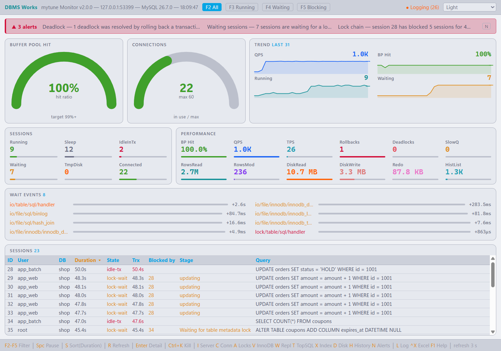
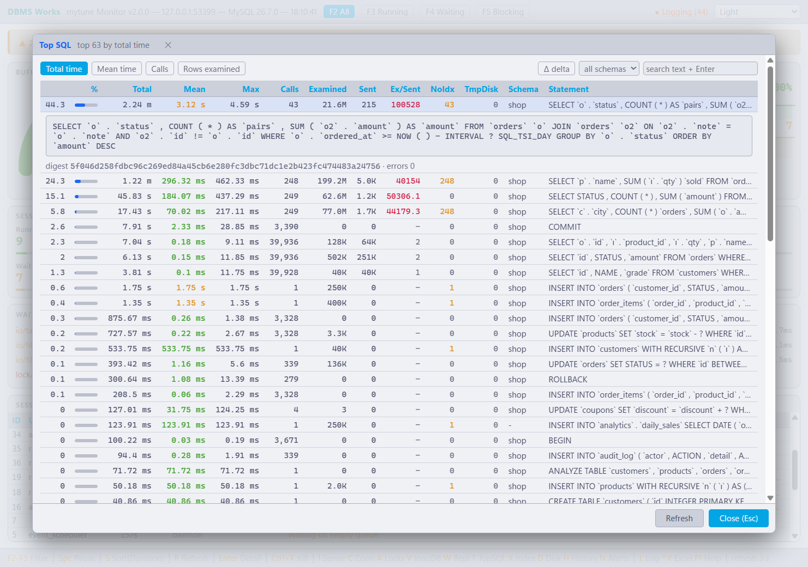
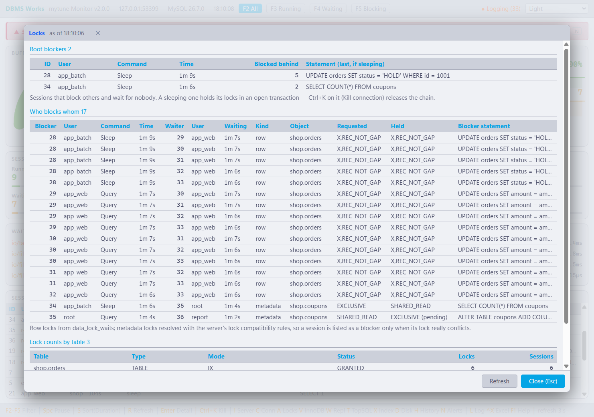
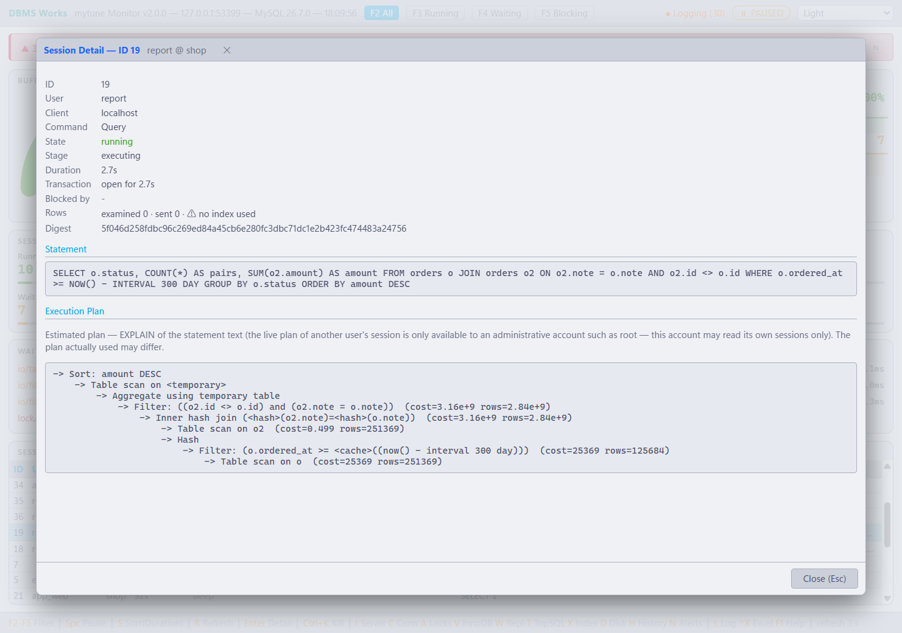
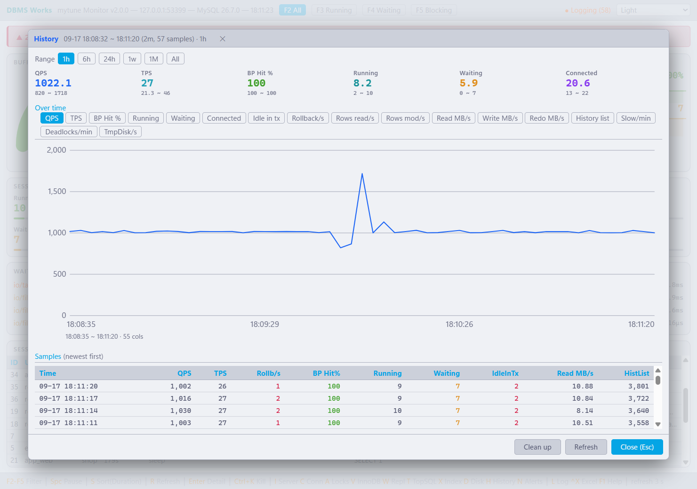
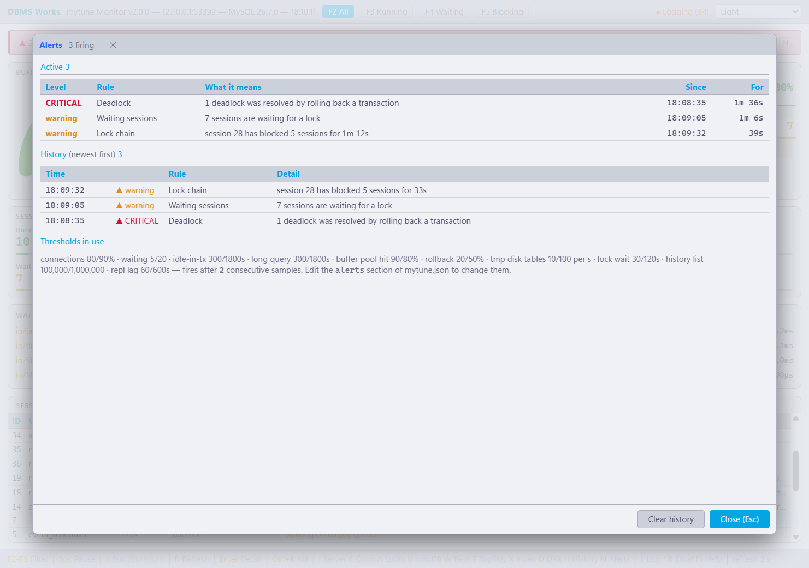
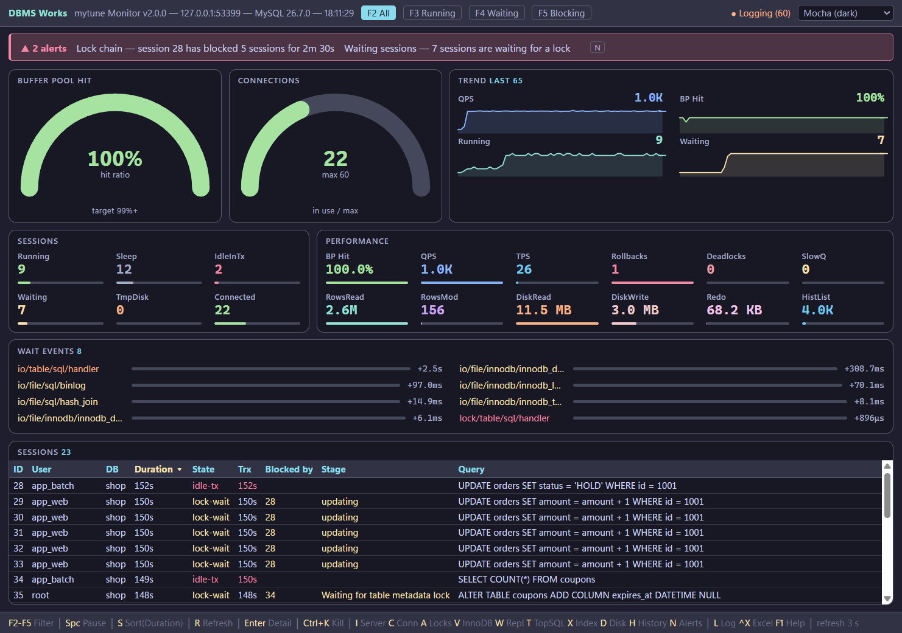

# mytune — MySQL 실시간 모니터 (무료)


**[최신 배포본 내려받기](https://github.com/Doni-Kim/mytune-release/releases/latest)** ·
[English](README.md) · [매뉴얼 (HTML)](mytune.html)

MySQL 상태를 실시간으로 보는 데스크톱 모니터입니다. 창 하나 · 실행 파일 하나이고, 서버에는 아무것도 설치하지 않습니다 —
`performance_schema` · `information_schema` · `sys` 만 읽습니다. 부담 없이 쓰시라고 공유드립니다.

## 화면

| 실시간 대시보드 | Top SQL |
|---|---|
|  |  |

| 락 사슬 | 세션 상세 |
|---|---|
|  |  |

| History | 알림 |
|---|---|
|  |  |



화면은 촬영용으로 잠깐 띄운 서버의 가상 `shop` 스키마입니다.

## 설치·설정

- 압축을 풀고 폴더째 둔 뒤 `mytune.exe` 를 실행하면 됩니다 (Single File Publishing).
- .NET 설치 불필요 — 런타임이 실행 파일에 포함되어 있습니다.
- 처음 실행하면 접속 창이 뜹니다. 실제로 접속된 뒤에 실행 파일 옆 `mytune.json` 에 저장합니다(비밀번호는 암호화해서 저장).

## 주요 기능

- **실시간 대시보드**: 버퍼 풀 적중률 · 접속 수 · QPS / TPS / 롤백 · 읽고 고친 행 · 디스크 / redo 처리량 · history list · 대기 이벤트 · 추이 그래프 · 세션 표.
  서버의 누적 카운터는 늘 직전 주기와의 차이로 보여 줍니다.
- **진짜 blocker 를 짚는 락 사슬**: 행 락은 `data_lock_waits` 로, 메타데이터 락은 서버의 락 호환성 규칙으로 판정해 실제로 충돌하는 세션만 blocker 로 냅니다.
  `F5` 는 막는 세션과 막힌 세션을 함께 보여 줍니다.
- **세션 상세**(`Enter`): 문장 전문 · 실행 계획 · 쥔 락 · 접속 속성. `Ctrl+K` 로 쿼리만 또는 접속째 KILL, `Ctrl+X` 로 Excel 저장.
- **팝업**: Server(`I`) · Connections(`C`) · Locks(`A`) · InnoDB(`V`) · Replication(`W`) · Top SQL(`T`, 델타 · 검색) · 인덱스 진단(`X`) · Disk(`D`).
- **임계값 알림** 12종: 접속 포화 · 대기 세션 · idle in transaction · 긴 문장 · 버퍼 풀 적중률 · 롤백 비율 · 디스크 임시 테이블 · 락 사슬 · 데드락 · history list · 복제 지연 · 복제 스레드 중단.
- **History**: `L` 로 로컬 SQLite 에 모니터링 데이터를 쌓고, `H` 로 지난 흐름을 되짚습니다.
  - 구간은 1시간 / 6시간 / 24시간 / 1주 / 1개월 / 전체, 지표는 17가지입니다.
  - 오래된 기록은 자동으로 지웁니다(기본 지표 30일 · 세션 7일, `mytune.json` 에서 조정).
- Excel 저장: ClosedXML 기반이라 Excel 이 없어도 xlsx 파일이 저장됩니다.
- 테마 12종(밝은 6 · 어두운 6). 접속이 끊기면 스스로 다시 붙습니다.
- `F1` 을 누르면 단축키 도움말이 나옵니다.

자세한 사용법은 첨부한 `mytune.html`(스크린샷이 든 매뉴얼)을 참고해 주세요. 사용상 제한 없습니다.

## 지원 범위 · 제약사항

- UI 가 Web 기반(Blazor Hybrid)이라 **Windows 전용**입니다. Linux·macOS 에서는 단독 실행되지 않습니다.
- **MySQL 8.0 이상** + `performance_schema=ON`. 8.0.46 과 최신판에서 확인했습니다.
  `performance_schema` 구성이 같은 MySQL 호환 배포판(Percona Server 8.0+ 등)도 같은 방식으로 동작합니다.
- **MariaDB 는 지원하지 않습니다** — `performance_schema` 에 `data_locks` · `data_lock_waits` 가 없습니다. 접속하면 접속 창에서 알려 줍니다.
- 코드는 ConfuserEx 로 난독화(무료 툴이라 강력한 수준은 아닙니다).

## 모니터링 전용 계정

```sql
CREATE USER 'mytune'@'%' IDENTIFIED BY '...';
GRANT PROCESS ON *.* TO 'mytune'@'%';                  -- 다른 사용자의 세션, innodb_metrics
GRANT SELECT ON performance_schema.* TO 'mytune'@'%';
GRANT SELECT ON sys.* TO 'mytune'@'%';                 -- 인덱스 진단
GRANT REPLICATION CLIENT ON *.* TO 'mytune'@'%';       -- 선택: Replication 팝업 · 복제 알림
GRANT CONNECTION_ADMIN ON *.* TO 'mytune'@'%';         -- 선택: 남의 세션에 Ctrl+K
```

이런 계정에서는 세션 상세의 실행 계획이 *추정 계획*으로 나옵니다(화면에 그렇게 적힙니다). 다른 사용자가 돌리는 문장의 실제 계획은 root 같은 관리자 계정에서만 볼 수 있습니다.

## 화면이 안 뜬다면 (WebView2)

창은 뜨는데 내용이 백지라면 WebView2 런타임이 없는 경우입니다.

- **Windows 11**: OS 에 기본 내장이라 항상 있습니다.
- **Windows 10**: 2021년 이후 Windows Update 로 대부분 자동 배포됐지만, 업데이트를 오래 안 한 PC 나 LTSC 같은 특수 에디션에는 없을 수 있습니다.
- **Windows Server (2016/2019/2022)**: 기본 미포함인 경우가 많아 별도 설치가 필요할 수 있습니다.

없으면 Microsoft 의 "에버그린 독립형 설치 프로그램"(`MicrosoftEdgeWebView2RuntimeInstallerX64.exe`)을 설치하시면 됩니다.
→ https://developer.microsoft.com/microsoft-edge/webview2/

## 문제가 생기면

오류가 나면 실행 파일 옆에 `mytune.log` 가 생깁니다(평소에는 만들지 않고, 비밀번호는 기록하지 않습니다). 그 파일을 메일로 보내 주시면 됩니다.

## 기술 스택

- .NET 11.0 (x64), C# 15, Blazor Hybrid
- 패키지: MySqlConnector · Microsoft.Data.Sqlite · ClosedXML · Microsoft.Web.WebView2 · Microsoft.AspNetCore.Components.WebView.WindowsForms
- 실행 파일에 묶인 위 오픈소스들의 저작권 고지 · 라이선스 전문: [THIRD-PARTY-NOTICES.txt](THIRD-PARTY-NOTICES.txt) (zip 안에도 들어 있습니다)

## mytune.json 예시

직접 만들지 않아도 됩니다 — 접속 창이 만들어 줍니다. 미리 채워 두려면:

```json
{
  "databases": [
    {
      "userId": "root",
      "password": "change-me",
      "server": "127.0.0.1",
      "port": "3306",
      "database": "",
      "sslMode": "preferred"
    }
  ],
  "interval": 3
}
```

- `password` 는 평문으로 적으면 첫 실행 때 자동 암호화됩니다.
- `database` 는 비워도 됩니다 — mytune 은 서버 전체를 봅니다.
- `sslMode`: `none` / `preferred` / `required`.
- `alerts`, `topSql`, `logRetention` 같은 절은 적지 않아도 됩니다. zip 안의 `mytune_sample_kr.json` 에 모든 설정의 설명이 있습니다.

## 사용 조건

업무든 개인이든 자유롭게 쓰셔도 됩니다. 실행 파일 재배포와 리버스 엔지니어링은 삼가 주세요.
소스는 공개하지 않습니다.
